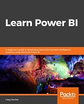

# Learn Power BI
[Learn Power BI](https://www.packtpub.com/data/learn-power-bi), published by [Packt](https://www.packtpub.com/) 

##Learn 
<li>Explore the different features of Power BI to create interactive dashboards</li>
<li>Use the Query Editor to import and transform data</li>
<li>Perform simple and complex DAX calculations to enhance analysis</li>
<li>Discover business insights and tell a story with your data using Power BI</li>
<li>Explore data and learn to manage datasets, dataflows, and data gateways</li>
<li>Use workspaces to collaborate with others and publish your reports</li>

##About 

To succeed in today’s transforming business world, organizations need business intelligence capabilities to make smarter decisions faster than ever before. This Power BI book is an entry-level guide that will get you up and running with data modeling, visualization, and analytical techniques from scratch.

You’ll find this book handy if you want to get well-versed with the extensive Power BI ecosystem. You’ll start by covering the basics of business intelligence and installing Power BI. You’ll then learn the wide range of Power BI features to unlock business insights. As you progress, the book will take you through how to use Power Query to ingest, cleanse, and shape your data, and use Power BI DAX to create simple to complex calculations. You’ll also be able to add a variety of interactive visualizations to your reports to bring your data to life. Finally, you’ll gain hands-on experience in creating visually stunning reports that speak to business decision makers, and see how you can securely share these reports and collaborate with others.

By the end of this book, you’ll be ready to create simple yet effective BI reports and dashboards using the latest features of Power BI.

##Features 
<li>Create effective storytelling reports by implementing simple-to-intermediate Power BI features</li> 
<li>Develop powerful analytical models to extract key insights for changing business needs</li>
<li>Build, publish, and share impressive dashboards for your organization</li>
